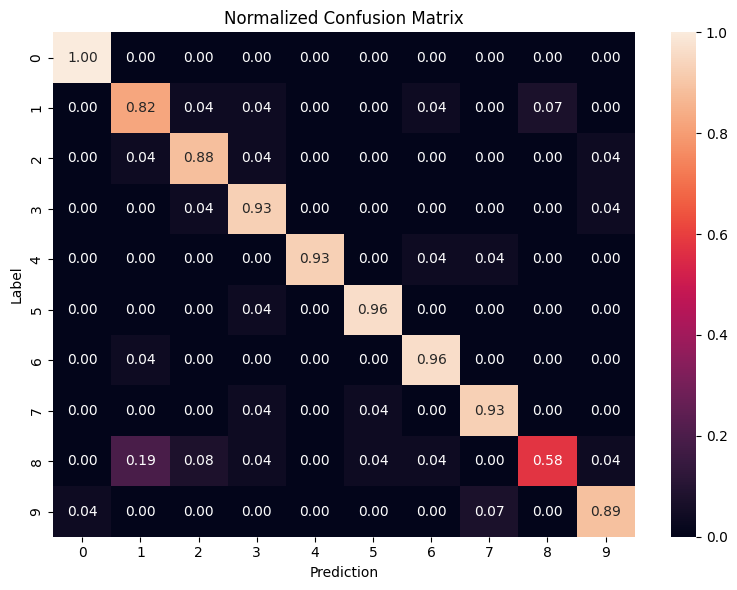

# Final Project Report: Binary Neural Network Accelerator on FPGA

## Team
This project was completed by Matt Hartnett.

GitHub Repository can be found [here](https://github.com/HartnettMatt/EmbeddedAI/tree/main/final-project).

## Project Overview
The goal was to build and verify a tiny binary neural network (BNN) accelerator for the 8x8 scikit-learn digits dataset to run on an FPGA. The design emphasized hardware-friendly XNOR-popcount primitives, a modest memory footprint, and deterministic behavior so the results could be reproduced in both software and hardware. A stretch goal was to add a small convolutional layer to improve accuracy, but the primary objective was delivering a reliable training-to-hardware flow.

## Motivation
FPGAs provide parallelism and customization for machine learning workloads and hardware accelerators without the required cost of an ASIC. They are well-suited to compact models like BNNs that map cleanly to bitwise logic, making them an ideal testbed for rapid architectural experiments and educational exploration.

## Technical Approach
The software pipeline begins with the [scikit-learn digits](https://scikit-learn.org/1.5/auto_examples/datasets/plot_digits_last_image.html) dataset, which is cached to `sw/dataset/digits.npz` on first run of `sw/model.py`. Images are normalized to the range [-1, 1] and flattened into 64-element vectors. The model itself is a two-layer BNN built from custom BinaryDense layers, batch normalization, and deterministic binary activations. The hidden layer width is 128 and the output layer produces ten-class softmax logits. Training uses fixed seeds for TensorFlow, NumPy, and Python to guarantee deterministic runs.

After training, the script exports weights, thresholds, and a manifest of binary layers into `sw/artifacts/`, along with `golden_vectors.npz` that captures representative inputs and expected classifications. These artifacts drive the hardware side of the project. The SystemVerilog accelerator in `hw/model.sv` is structured around XNOR-popcount compute, localized weight storage, and a simple streaming interface. A cocotb testbench (`hw/testbench.py`) consumes the exported artifacts, feeds images through Verilator, and checks class predictions while measuring latency.

## Results
The end-to-end flow runs cleanly: dataset caching, deterministic training, artifact export, and testbench stimulus generation all run smoothly. Validation accuracy and latency in simulation met the acceptable performance bar for a model of this scale, confirming that the binary formulation and quantization choices were reasonable. The pipeline is simple to rerun with `uv run python sw/model.py`, which refreshes the artifacts. The RTL simulation can be run within the `hw/` directory with a simple `uv run make`.

Shown below is a confusion matrix of the model demonstrating it's classification performance.

## Challenges and Lessons Learned
The convolutional stretch goal was unfortunately not completed due to time constraints. The tasks of stabilizing the export format and aligning Python to SystemVerilog took longer than initially expected. Bridging Python to RTL required careful handling of bit-packing, threshold formatting, and endianness, and those details surfaced later than expected. Model throughput improvements were also limited by schedule, so the focus remained on correctness and artifact stability.

Several lessons emerged. The “glue” work of dataset preparation, quantization, and export consumes more time than the model definition itself. Determinism through seeded runs and cached datasets is invaluable when iterating across software and hardware. Keeping the hardware interface narrow and the artifacts explicit made cocotb integration much smoother and reduced iteration time when debugging alignment issues.

## Future Work
Future iterations would add the convolutional front end to reduce error on harder digits. Implementing parallelized computation would raise throughput and better demonstrate the benefits of FPGAs. Extending cocotb coverage to corner cases (all-zero or all-one inputs, class boundaries) would make the verification more robust and performant as a regression test suite. 

## Conclusion
The project delivers a reproducible pipeline from Python training to SystemVerilog simulation for a binary neural network accelerator on FPGA. While some stretch goals remain, the current flow demonstrates that a small, deterministic BNN can be trained, exported, and validated end to end with a clear handoff between software and hardware. The groundwork is in place to iterate on accuracy and throughput without reworking the core integration steps.
